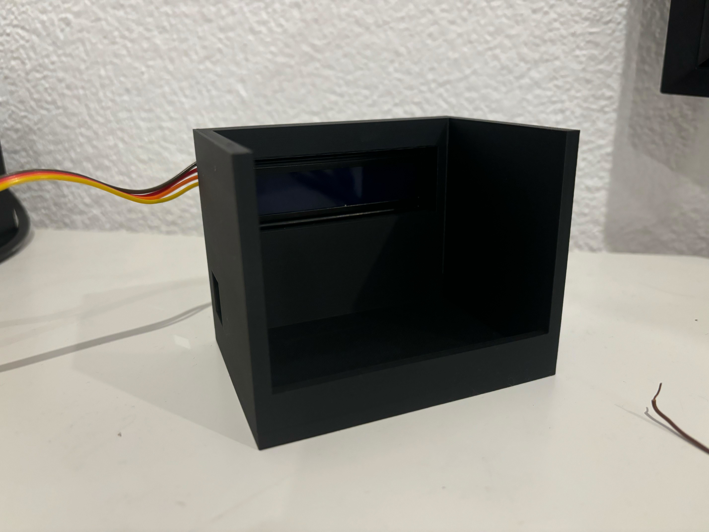
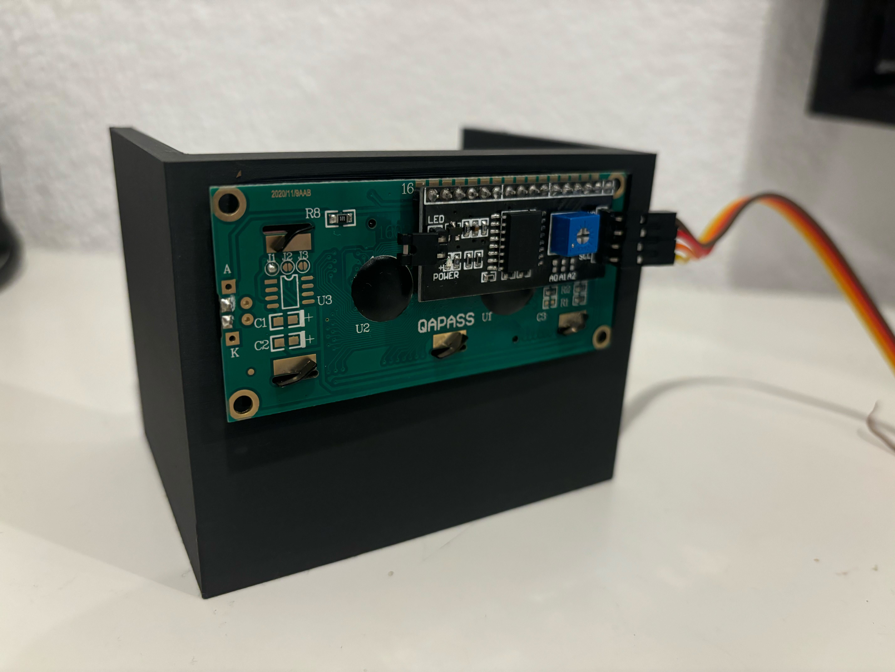
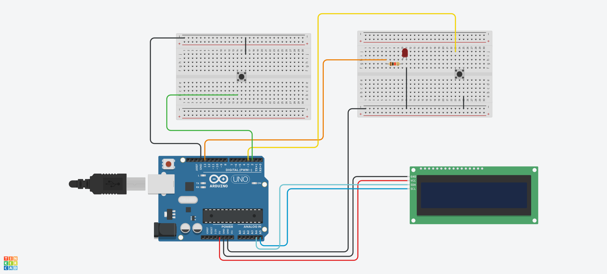
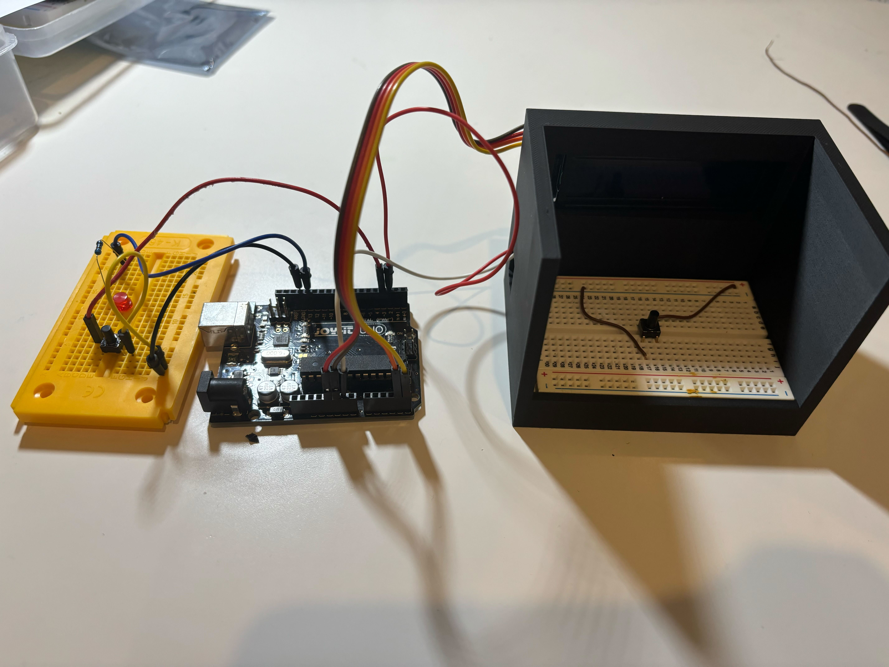

# Reaction Test
## What you Need:
 - 3D-Printed Part (STL in repo)
 - Arduino Uno
 - LCD Display with I2C
 - 2 Buttons
 - Led
 - 1k Resistance

## How it Works:
1. You push the Button nearby the LCD, this starts a random timer to turn on the Led.
2. After 5-10 seconds the Led turn on.
3. When the Led turn on you must push the Button near by the Led.
4. On the LCD you will get the time in milliseconds.

## How to Build:
1. Do the LCD in the 3D-Model:  

 

2. Do the Breadboard with only on Button in the Model:  

 

3. Build the Circed like in the Picture:  

 

4. Finaly the Project shoud seening like this:  

 

## Upload the Code:

Copy the Code from [Skript.ino](Skript.ino) in the Arduino Ide and Upload the Code on your Arduino UNO  
Don't forget to download the LiquidCrystal_I2C and the Wire library.  
https://www.arduino.cc/reference/en/libraries/liquidcrystal-i2c/
